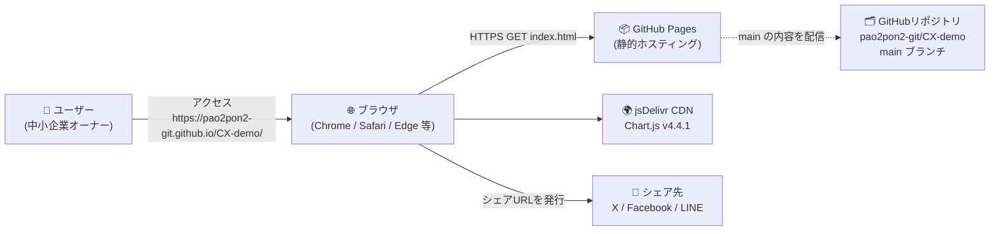
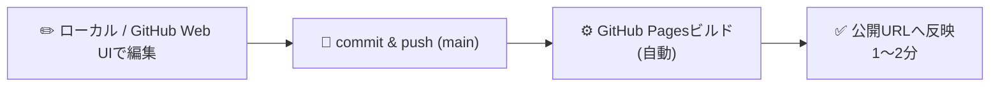
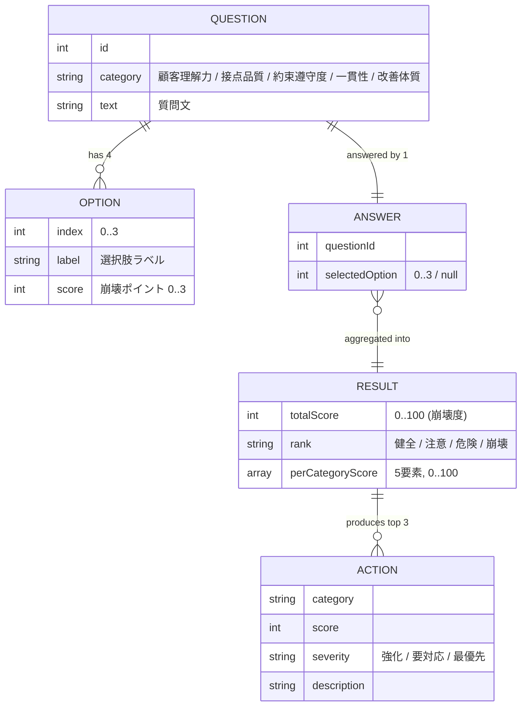
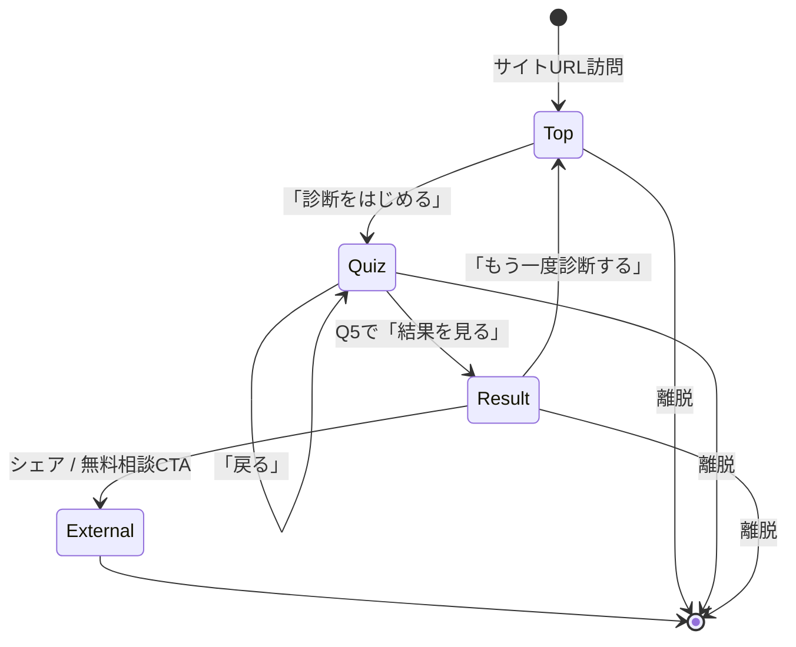
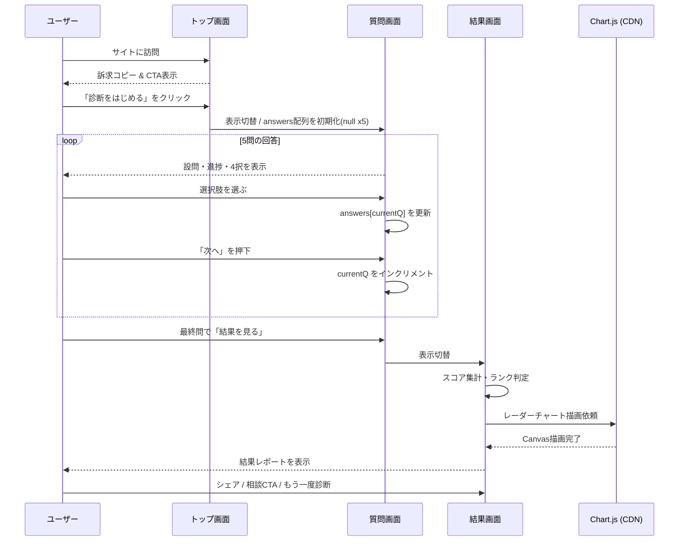

# CX崩壊度診断ツール 設計書

| 項目 | 内容 |
| :--- | :--- |
| プロダクト名 | CX崩壊度診断ツール |
| バージョン | 1.0 |
| ドキュメント種別 | 設計書（システム構成図／データ設計書／画面遷移図） |
| 対象ユーザー | 中小企業オーナー全般 |
| 公開URL | https://pao2pon2-git.github.io/CX-demo/ |
| 配信形態 | 静的Webサイト（GitHub Pagesによるホスティング） |
| 最終更新日 | 2026-05-03 |

---

## 0. ドキュメントの目的と読み方

本ドキュメントは、外部公開している「CX崩壊度診断ツール」の **構造を最小限の情報量で正しく把握できる** ようにまとめた設計書です。実装は単一HTMLファイル（クライアントサイドのみ／サーバー処理なし）で構成されているため、一般的なWebアプリ設計書のように複雑なコンポーネント分割は行いません。代わりに、以下3点に絞って図解します。

1. **システム構成図** — どこに何が置かれ、どう配信されるかの全体像
2. **データ設計書** — アプリ内で扱う「設問」「回答」「スコア」「結果」のデータ構造
3. **画面遷移図** — トップ / 質問 / 結果レポートの3画面の動き

「Mermaid」というMarkdown内に図を書ける記法を採用しているため、GitHub上で本ファイルを開けば図がそのまま描画されます。

---

## 1. システム構成図

### 1.1. 全体構成

本ツールは **サーバーサイド処理を持たないシングルページアプリケーション（SPA相当）** です。すべての処理がブラウザ内で完結し、外部に保存されるデータはありません。



### 1.2. 構成要素の役割

| 要素 | 役割 | 備考 |
| :--- | :--- | :--- |
| ユーザー | 中小企業オーナー。スマホ／PCどちらからもアクセス | 個人情報入力なし |
| ブラウザ | HTML/CSS/JS を解釈し、診断ロジックを実行 | モダンブラウザを想定 |
| GitHub Pages | 静的ファイルを配信するホスティング基盤 | 無料・HTTPS自動付与 |
| GitHubリポジトリ | ソース管理。`main` ブランチが本番に直結 | Public設定 |
| jsDelivr CDN | レーダーチャート用ライブラリ Chart.js を配信 | バージョン固定でロード |
| シェア先 | 結果画面からのSNSシェア導線 | URLパラメータ経由 |

### 1.3. 技術スタック

| レイヤ | 採用技術 | 採用理由 |
| :--- | :--- | :--- |
| マークアップ | HTML5 | 標準仕様、互換性が高い |
| スタイル | CSS3（インライン `<style>`） | ファイル分割なし＝配信容易 |
| スクリプト | Vanilla JavaScript（フレームワーク不使用） | ビルド不要・学習コスト低 |
| 描画ライブラリ | Chart.js 4.4.1 | レーダーチャートに必要十分、CDN利用可 |
| ホスティング | GitHub Pages | 無料・SSL対応・GitHub連携で更新が容易 |
| バージョン管理 | Git / GitHub | 改修履歴と差し戻しの担保 |

### 1.4. デプロイフロー



`main` ブランチへの変更が自動的に公開へ反映されるシンプルなフローです。ステージング環境は持たず、必要に応じてブランチを切って `gh-pages` 等の別ブランチで一時公開する運用が可能です。

### 1.5. 非機能要件サマリ

| 項目 | 内容 |
| :--- | :--- |
| 可用性 | GitHub Pagesに準拠（一般公開SLAは99.9%相当） |
| パフォーマンス | 単一HTMLで100KB前後、初回表示1〜2秒以内を想定 |
| セキュリティ | サーバー処理なし＝攻撃面が極小。個人情報も保持せず |
| プライバシー | 回答データはブラウザ内に留まり、外部送信されない |
| ブラウザ対応 | モダンブラウザ最新2バージョン（Chrome / Safari / Edge / Firefox） |
| アクセシビリティ | キーボード操作可。色のみに依存しない判定表現は今後の改善対象 |

---

## 2. データ設計書

### 2.1. データの全体像

本ツールが扱うデータは以下4種類です。すべて **ブラウザ内のメモリ上にのみ存在** し、ページを閉じると消滅します。



### 2.2. エンティティ定義

#### 2.2.1. Question（設問）

ツール起動時に静的に読み込まれる固定データです。全5件、各設問は1つのカテゴリに紐づきます。

| 項目 | 型 | 必須 | 説明 |
| :--- | :--- | :--- | :--- |
| id | number | ○ | 0始まりの通番（0〜4） |
| category | string | ○ | 該当カテゴリ名（後述5種のいずれか） |
| text | string | ○ | 質問文 |
| options | Option[] | ○ | 選択肢配列、必ず4件 |

#### 2.2.2. Option（選択肢）

各設問に4つずつ紐づきます。`score` の値が大きいほど「CXが崩壊している」状態を示します。

| 項目 | 型 | 必須 | 説明 |
| :--- | :--- | :--- | :--- |
| index | number | ○ | 0〜3 |
| label | string | ○ | 表示テキスト |
| score | number | ○ | 0（健全）〜3（崩壊） |

#### 2.2.3. Answer（回答）

ユーザーが選んだ選択肢のインデックスを設問ごとに保持します。未回答は `null`。

| 項目 | 型 | 必須 | 説明 |
| :--- | :--- | :--- | :--- |
| questionId | number | ○ | 対応する設問ID |
| selectedOption | number\|null | ○ | 0〜3 または `null` |

#### 2.2.4. Result（診断結果）

全5問を回答後に算出されるサマリ。表示後はメモリから消去可能。

| 項目 | 型 | 必須 | 説明 |
| :--- | :--- | :--- | :--- |
| totalScore | number | ○ | 0〜100の崩壊度（高いほど崩壊） |
| rank | string | ○ | 「健全 / 注意 / 危険 / 崩壊」のいずれか |
| perCategoryScore | number[] | ○ | カテゴリごとの崩壊度（0〜100、5要素） |
| verdict | string | ○ | ランク別の所見テキスト |

#### 2.2.5. Action（改善アクション提案）

崩壊度上位3カテゴリに対して、それぞれ1件ずつ動的に生成される提案。

| 項目 | 型 | 必須 | 説明 |
| :--- | :--- | :--- | :--- |
| category | string | ○ | 対象カテゴリ名 |
| score | number | ○ | 該当カテゴリの崩壊度（0〜100） |
| severity | string | ○ | 「強化 / 要対応 / 最優先」 |
| description | string | ○ | 提案文（カテゴリ別アクションライブラリより取得） |

### 2.3. カテゴリ一覧

| ID | カテゴリ名 | 評価対象 |
| :-- | :--- | :--- |
| C1 | 顧客理解力 | 顧客の生の声を吸い上げる頻度・方法 |
| C2 | 接点品質 | 問い合わせ等への一次対応スピード |
| C3 | 約束遵守度 | 納期・品質・対応の約束履行度 |
| C4 | 一貫性 | 担当者によらない品質の均一性 |
| C5 | 改善体質 | フィードバックを改善に変換する仕組み |

### 2.4. スコアリング設計

#### 2.4.1. カテゴリ別崩壊度（0〜100）

```
カテゴリ別崩壊度 = (該当設問の選択スコア / 3) × 100
```

`score=0` なら崩壊度0／`score=3` なら崩壊度100となり、各カテゴリ単独でも100点満点で評価できます。

#### 2.4.2. 総合崩壊度（0〜100）

```
総合崩壊度 = (5問のスコア合計 / 15) × 100
```

最大15ポイント（5問×3点）を100点満点に正規化しています。

#### 2.4.3. ランク判定

| 総合崩壊度 | ランク | 状態の意味 |
| :--- | :--- | :--- |
| 0〜25 | 健全 | 安定運用。さらに上を目指せる段階 |
| 26〜50 | 注意 | 兆候あり。弱点カテゴリから手を打つべき |
| 51〜75 | 危険 | 顧客はすでに不満を抱えている可能性が高い |
| 76〜100 | 崩壊 | 緊急事態。CXの再構築が必要 |

#### 2.4.4. 改善アクションの選定ロジック

カテゴリ別崩壊度が高い順に上位3カテゴリを抽出し、各カテゴリ用の「アクションライブラリ」から1件を選択して提示します。優先度は崩壊度に応じて以下のように分類します。

| 該当カテゴリの崩壊度 | severity（タグ表示） |
| :--- | :--- |
| 67〜100 | 最優先 |
| 34〜66 | 要対応 |
| 0〜33 | 強化 |

### 2.5. データの永続化と取扱い

| 観点 | 内容 |
| :--- | :--- |
| 保存場所 | ブラウザのメモリ上（JS変数）のみ |
| サーバー送信 | なし。回答は一切外部に送信されない |
| 個人情報 | 取得しない |
| Cookie / LocalStorage | 現バージョンでは未使用 |
| 結果の引き継ぎ | リロードで消える。必要な場合は将来的にURLパラメータ経由のシェア対応を検討 |

---

## 3. 画面遷移図

### 3.1. 全体遷移



### 3.2. 各画面の構成と役割

#### 3.2.1. トップ画面（`#screen-top`）

| 要素 | 内容 |
| :--- | :--- |
| 主目的 | 診断を開始してもらう動機付け |
| 主な構成 | キャッチコピー／3つの特徴／CTAボタン |
| 主要アクション | `診断をはじめる →` ボタン → 質問画面へ遷移 |
| 補助アクション | `この診断について` ボタン → 同ページ内アンカー移動 |

#### 3.2.2. 質問画面（`#screen-quiz`）

| 要素 | 内容 |
| :--- | :--- |
| 主目的 | 5問の回答を取得 |
| 主な構成 | 進捗バー（`q-cur / q-total / q-pct`）／カテゴリタグ／設問文／4択ボタン／戻る・次へボタン |
| 主要アクション | 選択肢クリック → `Answer.selectedOption` を更新 |
| 遷移制御 | 未回答時は `次へ` ボタンを無効化（disabled） |
| 戻る | `戻る` で前問に戻り、回答は保持 |
| 完了 | 最終問で `次へ` のラベルが「結果を見る →」に変化 |

#### 3.2.3. 結果画面（`#screen-result`）

| 要素 | 内容 |
| :--- | :--- |
| 主目的 | 総合スコアの提示と次のアクションへの誘導 |
| 主な構成 | 総合スコア（アニメーションカウントアップ）／ランク／所見／レーダーチャート／改善アクション3件／シェアボタン／CTA |
| 主要アクション | `無料相談を予約する` / 各種シェアボタン / `URLをコピー` / `もう一度診断する` |
| 内部処理 | 結果計算 → ランク判定 → Chart.jsでレーダー描画 → アクション選定・描画 → シェアURL組み立て |

### 3.3. 画面間データフロー



### 3.4. 状態管理（ブラウザ内）

| 変数 | 役割 | 初期値 |
| :--- | :--- | :--- |
| `currentQ` | 現在の設問インデックス（0〜4） | 0 |
| `answers[]` | 各設問の選択肢インデックス | `[null, null, null, null, null]` |
| `radarChart` | Chart.jsインスタンス参照 | null |

各画面の表示制御は、`<section>` 単位で `.active` クラスを付け替えるシンプルな仕組みです（`show(id)` 関数）。SPA風の疑似ルーティングですが、URLパスは変化しないため、現状は履歴管理（`back`／`forward`）には対応していません。

---

## 4. 今後の拡張に向けたメモ

設計を最小に保つために現バージョンで意図的に省略した機能を、想定される拡張順に列挙します。

1. **回答結果のURL化**：回答の選択肢インデックスをURLパラメータに埋め、シェア時に同じ結果ページを開けるようにする
2. **アクセス解析**：Google Analytics / Microsoft Clarity 等で離脱ポイントを把握
3. **A/Bテスト**：ランディングコピーやCTA文言の比較
4. **多言語対応**：JSON化された設問データを言語別に切替
5. **問い合わせフォーム接続**：CTAから外部フォーム（Formspree, Tally, HubSpot等）へのリンク or 埋め込み
6. **管理画面**：設問やランク閾値をオーナー側で更新できるGUI（要バックエンド導入）

---

## 5. 用語集

| 用語 | 説明 |
| :--- | :--- |
| CX | Customer Experience（顧客体験）。製品・サービスを通じた顧客とのあらゆる接点で得られる体験の総称 |
| 崩壊度 | 本ツール独自の概念。CXに関する5項目の不健全さを0〜100で正規化したスコア |
| ランク | 崩壊度をビジネスインパクトの観点で4段階に分類したラベル |
| GitHub Pages | GitHubが提供する静的ファイルホスティングサービス |
| Mermaid | Markdown内に図を記述するための記法。GitHubで自動描画される |

---

*本書は設計の概要を示すものです。実装の詳細は `index.html` のソースコードを参照してください。*
